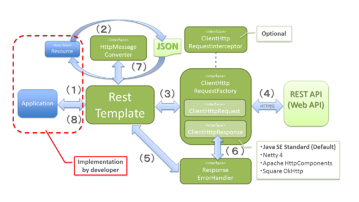

# RestTemplate 정리

Object Storage, SKM, 통합 로그인 API 호출 등에서 사용했던 RestTemplate에 대해 정리해봤습니다.

## RestTemplate이란?

- Spring에서 제공하는 http 통신에 유용하게 사용할 수 있는 템플릿
- 동기적인 Http Client 클래스
- Spring 3.0부터 지원
- HTTP Connection으로 동작

## RestTemplate 동작 원리

출처:
https://docs.spring.io/spring-framework/docs/current/javadoc-api/org/springframework/web/client/RestTemplate.html
https://flowarc.tistory.com/entry/Spring-RestTemplate
https://sjh836.tistory.com/141